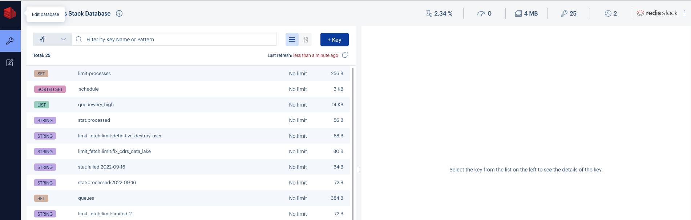

<h1 align="center">Redis Stack Server</h1>

<p align="center">
 A Docker template to create a Full Stack Redis Server in your environment.
</p>

<p align="center">
  <a href="https://redis.io/docs/stack/" target="_blank">Redis Stack Server</a>
</p>

<p align="center" width="100%">
  
</p>

## How to use?

```bash
docker-compose up -d --build
```

Check your logs.

```bash
docker logs -f redis-stack
```

## Modules availables?

RedisJSON, RediSearch, RedisGraph, RedisTimeSeries, and RedisBloom, RedisInsight

## RedisInsight Available

Acess the Redis Insight using 8002 port.

<p align="center" width="100%">
  
</p>


## License

The Dockerfile and associated scripts and documentation in this project are released under the [MIT License](LICENSE).

## Contributing

We have a long list of valued contributors. Check them all at: https://github.com/thadeu/redis-stack-server.